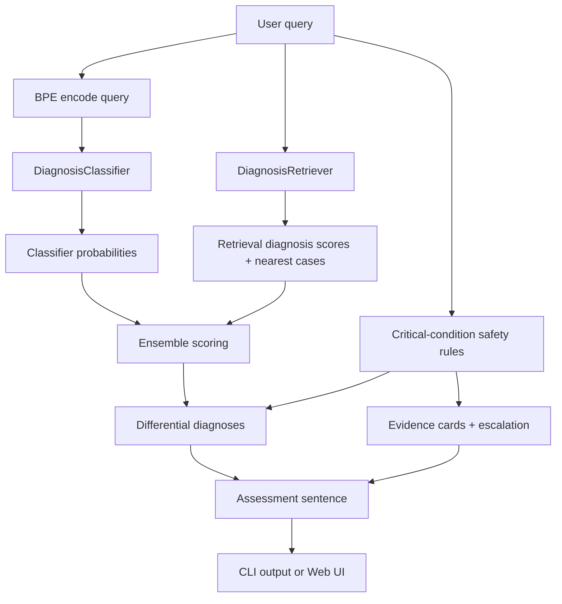

# MINI-RAG-QUANT Architecture

## Purpose

`MINI-RAG-QUANT` is a compact AI demo built to show a simple but important idea:

- a useful model pipeline can stay interpretable
- the model memory footprint can shrink significantly after quantization
- runtime memory can also be reduced through KV-cache optimization

The symptom-to-diagnosis workflow is the demo workload. It gives the project a realistic end-to-end task, but the primary hackathon story is still memory efficiency:

- `before quantization`: floating-point weights
- `after quantization`: estimated INT8 weights
- `runtime memory story`: reference KV-cache estimates and sliding-window savings

## System Overview

At a high level, the project has six layers:

1. `Data layer`
   Loads the base dataset, local supplements, and the larger normalized expansion dataset.
2. `Tokenizer layer`
   Trains or loads a byte-level BPE tokenizer for symptom text and diagnosis labels.
3. `Model layer`
   Trains or loads a compact transformer encoder classifier.
4. `Retrieval layer`
   Retrieves similar training cases to ground predictions and improve robustness.
5. `Safety layer`
   Detects must-not-miss conditions, supports abstention, and builds clinician-style output.
6. `Presentation layer`
   Exposes the pipeline through the CLI and a browser UI with quantization and KV-cache metrics.

## Main Execution Flow

## Runtime Entry Points

- `src/main.py`
  Main CLI entry point. Trains or loads everything, prints memory statistics, evaluates the stack, and answers one query.
- `src/webapp.py`
  Browser demo entry point. Reuses the same runtime and presents the output in a more polished hackathon UI.

## Directory Map

- `src/`
  Python source files.
- `data/`
  Cached datasets, labels, tokenizer metadata, benchmark data, and metrics.
- `model_diagnosis.pth`
  Saved classifier checkpoint.
- `README.md`
  Hackathon-facing project summary.

## Architecture by File

### `src/bpe.py`

Role: tokenizer training and tokenization utilities.

This file is responsible for teaching the project how to break symptom text into reusable subword units. The model never sees raw strings directly; it sees token IDs created here.

#### Functions

- `default_tokenizer_path(data_dir)`
  Returns the default path where the trained BPE tokenizer JSON should live.

- `default_tokenizer_metadata_path(data_dir)`
  Returns the default path for tokenizer metadata such as vocab size and training settings.

- `_load_training_texts(source)`
  Accepts either a `Path` or an iterable of strings. If it receives a file path, it reads the lines from disk. If it receives an iterable, it filters blank lines. This is a small input-normalization helper for tokenizer training.

- `_write_metadata(metadata_path, tokenizer, num_training_texts, vocab_size_requested, min_frequency)`
  Saves a metadata JSON file describing the trained tokenizer. This makes the tokenizer artifact easier to inspect later.

- `train_or_load_tokenizer(corpus_source, tokenizer_path, metadata_path=None, vocab_size=1024, min_frequency=2, force_retrain=False)`
  The central tokenizer function. It loads an existing tokenizer unless retraining is requested. If it needs to train, it builds a byte-level BPE tokenizer, fits it on the provided corpus, saves it, writes metadata, and returns the tokenizer object.

- `special_token_ids(tokenizer)`
  Looks up the IDs for `[PAD]`, `[UNK]`, `[BOS]`, `[EOS]`, and `[SEP]`. It raises an error if any are missing, which prevents later model bugs.

- `encode(tokenizer, text, add_special_tokens=True)`
  Converts text into token IDs. By default it adds `[BOS]` and `[EOS]`, which is useful for consistent sequence framing.

- `decode(tokenizer, ids, skip_special_tokens=True)`
  Converts token IDs back into text.

### `src/clinical_support.py`

Role: clinician-style safety logic, rule-based critical condition detection, evidence cards, and natural-language output wording.

This file is what moves the project away from a raw classifier into something safer and more presentation-ready. It powers the "unknown / clinician review" flow, must-not-miss alerts, and the final sentence output.

#### Dataclasses

- `EvidenceSource`
  Stores a source title and URL.

- `ConditionGuidance`
  Defines one curated critical condition, including symptom groups, escalation advice, related labels, and evidence sources.

- `ConditionMatch`
  Represents a successful safety-rule match for a user query.

- `CriticalBenchmarkExample`
  Represents one benchmark row in the curated must-not-miss evaluation file.

#### Functions

- `_normalize_text(text)`
  Lowercases text, strips punctuation, collapses whitespace, and pads it with spaces. This makes keyword matching more stable.

- `_pretty_list(items)`
  Formats a Python list into natural English like `a, b, and c`. It is used in the assessment sentence and rule rationale text.

- `ConditionMatch.name`
  Convenience property that returns the matched condition name.

- `ConditionMatch.rationale`
  Explains which symptom groups triggered the rule. This becomes readable output in the differential and safety panels.

- `default_critical_benchmark_path(data_dir)`
  Returns the default path for the curated benchmark JSONL file.

- `load_critical_benchmark(path)`
  Reads the benchmark file and returns a list of `CriticalBenchmarkExample` objects. If the file is missing, it returns an empty list.

- `_matches_group(normalized_text, group)`
  Checks whether any term in a keyword group appears in the normalized query text.

- `detect_critical_conditions(query, condition_set=None)`
  Runs the rule engine. It compares the normalized query against every curated critical condition, tracks matched symptom groups, enforces required groups and minimum group counts, scores the match, and returns the strongest matches first.

- `guidance_for_label(label)`
  Maps a model label back to a curated condition definition when possible. This lets predictions reuse the same summary and evidence logic as rule-based matches.

- `evidence_cards_for_conditions(safety_matches, labels)`
  Builds presentation-friendly evidence cards from safety matches and selected labels. Each card includes summary text, rationale, escalation advice, and source links.

- `build_assessment_sentence(primary_label, alternative_labels, unknown, low_confidence, safety_matches)`
  Produces the final natural-language summary sentence. This is the function that enables outputs such as:
  `This symptom pattern is most consistent with rabies, but meningitis and sepsis should also be considered.`

#### Constants

- `MUST_NOT_MISS_CONDITIONS`
  Curated safety rules for:
  - `rabies`
  - `sepsis`
  - `stroke`
  - `meningitis`
  - `acute coronary syndrome`
  - `ectopic pregnancy`

### `src/disease_data.py`

Role: dataset download, cleanup, merging, normalization, caching, and label-space creation.

This file is where the project constructs the training and test data used by the tokenizer and classifier.

#### Dataclasses

- `DiagnosisExample`
  Stores a pair of strings: `symptoms` and `diagnosis`.

#### Functions

- `default_dataset_dir(data_dir)`
  Returns the cache directory for the base diagnosis dataset.

- `default_labels_path(data_dir)`
  Returns the path for the saved label-space JSON file.

- `default_supplemental_dataset_dir(data_dir)`
  Returns the path for locally added diagnosis examples, such as the rabies supplement.

- `default_expanded_dataset_dir(data_dir)`
  Returns the path for the normalized large-scale expansion dataset cache.

- `normalize_text(text)`
  Trims and collapses whitespace.

- `normalize_diagnosis_label(text)`
  Standardizes diagnosis labels by lowercasing and stripping noisy prefixes like `You may have`.

- `normalize_symptom_query(text)`
  Standardizes symptom text by removing prompt-like prefixes and cleaning punctuation spacing.

- `_jsonl_path(dataset_dir, split)`
  Generates the file path for `train.jsonl` or `test.jsonl`.

- `_read_examples(path)`
  Reads JSONL data into `DiagnosisExample` objects.

- `_write_examples(path, examples)`
  Writes examples to JSONL and creates the parent directory if needed.

- `_normalize_example(example)`
  Applies symptom and diagnosis normalization to a single example.

- `_dedupe_examples(*groups)`
  Merges multiple lists of examples and removes duplicates using normalized `(symptoms, diagnosis)` pairs.

- `_load_local_split_examples(dataset_dir, split)`
  Reads locally supplied `train` or `test` examples if they exist.

- `build_or_load_expanded_dataset(dataset_dir, force_refresh=False, seed=7, max_train_per_label=16, max_test_per_label=2)`
  Downloads and normalizes the large expansion dataset, caps per-label counts to keep training manageable, writes a local cache, and returns split examples. If the cache already exists and refresh is not requested, it loads the cached JSONL files instead.

- `download_or_load_dataset(dataset_dir, force_refresh=False, supplemental_dirs=None)`
  Loads the base dataset, merges any local or expanded supplements, deduplicates the final split, writes metadata, and returns the merged result.

- `build_training_corpus(dataset_splits)`
  Produces the text corpus used to train the BPE tokenizer. It includes raw symptom strings, raw diagnosis strings, and formatted `symptoms/diagnosis` pair strings.

- `save_label_space(dataset_splits, labels_path)`
  Extracts the set of unique diagnoses, sorts them, writes them to JSON, and returns the final label list.

### `src/embed.py`

Role: legacy toy helper, not part of the active diagnosis pipeline.

#### Functions

- `embed(text)`
  Generates a deterministic random vector seeded by text length. This is not a semantic embedding function and is effectively a leftover stub from an earlier toy stage of the project.

### `src/kv_cache.py`

Role: reference KV-cache memory estimation for the hackathon demo.

This file does not run the diagnosis classifier itself. Instead, it computes the memory story that appears in the CLI and browser UI.

#### Dataclasses

- `KVCacheConfig`
  Stores the parameters needed to estimate cache size:
  - batch size
  - sequence length
  - number of layers
  - number of heads
  - head dimension

#### Functions

- `kv_cache_bytes(config, dtype_bytes)`
  Generic KV-cache formula. It multiplies the number of stored keys and values by the storage width in bytes.

- `kv_cache_fp32_bytes(config)`
  Returns the cache size if keys and values are stored in FP32.

- `kv_cache_fp16_bytes(config)`
  Returns the cache size if keys and values are stored in FP16.

- `kv_cache_int8_bytes(config, scale_bytes=4)`
  Estimates the cache size under INT8 quantization, including scale overhead.

- `kv_cache_sliding_window_fp16_bytes(config, window_size)`
  Estimates the cache size if only a sliding window of recent tokens is kept in FP16.

- `kv_cache_summary(config, window_size)`
  Returns a single dictionary with all major KV-cache numbers and ratios. Both the CLI and web UI rely on this helper.

### `src/model.py`

Role: neural network definitions.

This file contains two different model paths:

- the active `DiagnosisClassifier`, which is the real symptom classifier
- the older `MiniGPT`, which is kept for backward compatibility and KV-cache demonstration

#### Legacy MiniGPT path

- `Head`
  One masked self-attention head for autoregressive decoding.

- `Head.__init__(head_size, n_embd, block_size)`
  Builds the key, query, and value projections and stores a causal mask.

- `Head.forward(x)`
  Runs standard masked self-attention across the full sequence.

- `Head.forward_with_cache(x, past_k=None, past_v=None)`
  Runs incremental self-attention using cached keys and values. This is the low-level KV-cache implementation.

- `MultiHeadAttention`
  Parallel wrapper around multiple `Head` objects.

- `MultiHeadAttention.__init__(num_heads, head_size, n_embd, block_size)`
  Creates the attention heads and the output projection layer.

- `MultiHeadAttention.forward(x)`
  Runs all heads without cache and concatenates their outputs.

- `MultiHeadAttention.forward_with_cache(x, past=None)`
  Runs all heads with cached state and returns both the output and the next cache.

- `FeedForward`
  Two-layer MLP block used after attention.

- `FeedForward.__init__(n_embd)`
  Creates the `Linear -> ReLU -> Linear` feed-forward stack.

- `FeedForward.forward(x)`
  Applies the feed-forward network.

- `Block`
  One transformer block for the legacy GPT model.

- `Block.__init__(n_embd, n_head, block_size)`
  Builds attention, feed-forward, and layer normalization components.

- `Block.forward(x)`
  Runs the standard residual transformer block.

- `Block.forward_with_cache(x, past=None)`
  Runs the same block but also updates and returns the cache.

- `MiniGPT`
  Small autoregressive transformer kept for backward compatibility and KV-cache testing.

- `MiniGPT.__init__(vocab_size, n_embd, n_head, n_layer, block_size)`
  Constructs embeddings, transformer blocks, final normalization, and the language-model head.

- `MiniGPT.forward(idx, targets=None)`
  Produces token logits and optionally next-token training loss.

- `MiniGPT.generate(idx, max_new_tokens)`
  Generates text autoregressively without KV cache by repeatedly recomputing over the current context.

- `MiniGPT.forward_step(idx, past=None, position=0)`
  Performs one position-aware cached forward step and returns updated cache state.

- `MiniGPT.generate_with_kv_cache(idx, max_new_tokens)`
  Demonstrates cached generation. This is useful for showing a real KV-cache-aware decode path in the repo.

#### Active diagnosis model path

- `DiagnosisClassifier`
  The actual model used for symptom-to-diagnosis prediction.

- `DiagnosisClassifier.__init__(vocab_size, num_labels, max_length, pad_token_id, n_embd=96, n_head=4, n_layer=2, dropout=0.1)`
  Creates token embeddings, positional embeddings, a compact `TransformerEncoder`, layer normalization, and a classifier head.

- `DiagnosisClassifier.forward(input_ids, attention_mask)`
  Encodes the input sequence, masks padding, mean-pools valid token states, and returns logits over the diagnosis label space.

### `src/quantize.py`

Role: quantization utilities and memory-size estimation.

This file powers the core hackathon metric: model size before and after quantization.

#### Functions

- `floating_point_weight_bytes(state_dict)`
  Sums the byte size of all floating-point tensors in the model state dictionary.

- `estimated_int8_symmetric_per_tensor_bytes(state_dict)`
  Estimates weight storage after symmetric per-tensor INT8 quantization plus one scale per tensor.

- `quantize_tensor(t)`
  Performs a simple NumPy-based symmetric INT8 quantization of a tensor and returns the quantized values and scale.

- `quantize(v)`
  Thin wrapper around `quantize_tensor`.

- `dequantize(q, scale)`
  Reconstructs a float tensor from its INT8 values and scale.

### `src/retrieve.py`

Role: retrieval over training cases.

The project does not rely only on the classifier. It also scores similarity to known symptom cases and blends those scores into the final prediction.

#### Functions and classes

- `similarity(a, b)`
  Computes the dot product between two vectors. This belongs to an older dense-vector helper path.

- `retrieve(query_vec, doc_vecs, docs)`
  Returns the single best document from a list of dense vectors. This is also a legacy helper and is not the main retriever used today.

- `RetrievedCase`
  Stores one retrieved case with similarity score, symptoms, and diagnosis.

- `DiagnosisRetriever`
  Main retrieval engine used by the project.

- `DiagnosisRetriever.__init__(tokenizer, examples, reserved_token_count=5)`
  Stores the tokenizer and training examples, then builds the retrieval index.

- `DiagnosisRetriever._token_counts(text)`
  Tokenizes text and counts non-special BPE token IDs.

- `DiagnosisRetriever._fit()`
  Builds sparse TF-IDF-like vectors for all training examples and stores document norms for retrieval.

- `DiagnosisRetriever.retrieve(query, top_k=5)`
  Retrieves the top matching training examples for a new symptom query.

- `DiagnosisRetriever.diagnosis_scores(query, top_k=5)`
  Aggregates retrieved-case scores by diagnosis label and normalizes them into diagnosis-level retrieval probabilities.

### `src/main.py`

Role: end-to-end orchestration for the CLI.

This is the most important file in the repo because it ties together every other module.

#### Dataclasses

- `InferenceRuntime`
  Stores the built runtime:
  - parsed arguments
  - dataset splits
  - labels
  - tokenizer
  - classifier
  - retriever
  - device
  - classifier metrics

#### Functions

- `build_arg_parser()`
  Defines all CLI flags for training, inference, abstention behavior, expanded-data settings, and quantization/KV-cache reporting.

- `parse_args()`
  Parses command-line arguments using the parser above.

- `set_seed(seed)`
  Seeds Python and Torch randomness for reproducibility.

- `SymptomDiagnosisDataset`
  PyTorch dataset wrapper around pre-encoded symptom examples.

- `SymptomDiagnosisDataset.__init__(examples, tokenizer, label_to_id, max_length, pad_token_id)`
  Pre-encodes each example into tensors for efficient training and evaluation.

- `SymptomDiagnosisDataset._encode_example(example, tokenizer, label_to_id, max_length, pad_token_id)`
  Converts one training example into:
  - `input_ids`
  - `attention_mask`
  - integer `label`

- `SymptomDiagnosisDataset.__len__()`
  Returns the number of dataset rows.

- `SymptomDiagnosisDataset.__getitem__(idx)`
  Returns a single encoded row.

- `move_batch_to_device(batch, device)`
  Moves a batch of tensors to CPU or GPU.

- `evaluate(model, loader, device)`
  Evaluates the classifier on a data loader and returns loss, accuracy, and top-3 accuracy.

- `train_model(model, loader, device, epochs, learning_rate)`
  Runs the training loop with `AdamW` and cross-entropy loss.

- `save_checkpoint(path, model, labels, metrics, model_config)`
  Saves the trained model state, label space, metrics, and config.

- `load_checkpoint(path, device)`
  Loads a saved checkpoint onto the selected device.

- `normalized_entropy(probabilities)`
  Computes a normalized entropy score from the classifier distribution. Higher values mean greater uncertainty.

- `build_differential_diagnoses(ranked_scores, safety_matches, differential_size)`
  Creates the final ranked differential by combining model/retrieval scores with any rule-based safety matches.

- `evaluate_critical_condition_guardrails(examples, model, tokenizer, labels, max_length, retriever, device, classifier_weight, top_k, differential_size, abstain_threshold, margin_threshold, retrieval_threshold)`
  Runs the must-not-miss benchmark through the same inference pipeline and measures per-condition recall and recall-floor compliance.

- `build_or_load_model(tokenizer, labels, args, device, train_loader, test_loader)`
  Decides whether to retrain or reuse the diagnosis classifier, then returns the model and its metrics.

- `predict_query(query, model, tokenizer, labels, max_length, retriever, device, classifier_weight, top_k, differential_size, abstain_threshold, margin_threshold, retrieval_threshold)`
  Core inference function. It:
  - tokenizes the query
  - gets classifier probabilities
  - retrieves similar training cases
  - blends classifier and retrieval scores
  - computes uncertainty and open-set signals
  - runs safety rules
  - builds the final differential
  - creates the assessment sentence
  - prepares evidence cards and escalation messages

  This is the single most important inference function in the repo.

- `evaluate_prediction_stack(examples, model, tokenizer, labels, max_length, retriever, device, classifier_weight, top_k, differential_size, abstain_threshold, margin_threshold, retrieval_threshold)`
  Measures end-to-end performance of the combined stack, including retrieval and abstention behavior.

- `print_prediction(result)`
  Pretty-prints the structured prediction dictionary to the CLI.

- `save_metrics(metrics, tokenizer_vocab_size, labels, stack_metrics, critical_condition_metrics)`
  Writes the saved metrics JSON used by the browser UI.

- `reference_kv_cache_config(model, sequence_length, batch_size=1)`
  Extracts a same-scale reference decoder configuration from the classifier so the project can estimate KV-cache memory at comparable model dimensions.

- `build_runtime(args)`
  Builds the complete shared runtime used by both CLI and web:
  - optional expanded dataset cache
  - merged datasets
  - label space
  - tokenizer
  - train/test datasets
  - model
  - retriever

- `main()`
  CLI entry point. It:
  - parses args
  - sets the seed
  - builds the runtime
  - prints quantization and KV-cache metrics if requested
  - evaluates the test stack
  - evaluates the critical benchmark
  - saves metrics
  - predicts the user query
  - prints the final output

### `src/webapp.py`

Role: browser demo server.

This file reuses the same runtime as `main.py` but serves the results through an HTTP interface and a polished hackathon page.

#### Dataclasses

- `WebAppState`
  Stores the runtime, saved metrics, and default query shown in the UI.

#### Functions

- `parse_args()`
  Parses web-server-specific CLI arguments such as `host`, `port`, and the default query. It also inherits the core runtime flags from `main.py`.

- `_load_metrics()`
  Loads the saved metrics JSON if present.

- `_serialize_prediction(result)`
  Converts the rich prediction object into a JSON-safe payload for the browser.

- `_json_response(handler, payload, status=HTTPStatus.OK)`
  Sends a JSON HTTP response.

- `_html_response(handler, html, status=HTTPStatus.OK)`
  Sends an HTML HTTP response.

- `render_index(state)`
  Generates the full web page. It calculates model-size and KV-cache metrics, injects them into the frontend bootstrap payload, and returns the HTML, CSS, and JavaScript for the UI.

- `build_handler(state)`
  Builds a request-handler class that closes over the current application state.

- `RequestHandler.log_message(format, *args)`
  Silences default HTTP server logging.

- `RequestHandler.do_GET()`
  Handles:
  - `/`
  - `/api/metrics`
  - `/health`

- `RequestHandler.do_POST()`
  Handles `/api/predict`, validates the request, calls `predict_query`, and returns the serialized result.

- `main()`
  Web entry point. It:
  - parses args
  - seeds randomness
  - builds the shared runtime
  - loads saved metrics
  - starts the threaded HTTP server

## Shared Design Decisions

### 1. Retrieval + classifier instead of classifier alone

The classifier gives generalization, while retrieval gives grounding in known examples. Blending them improves interpretability and makes the output easier to explain during a demo.

### 2. Open-set behavior instead of forced certainty

The system can abstain when confidence is low or when red-flag rules indicate a dangerous presentation. This is safer than always returning one label.

### 3. Natural-language output instead of raw labels

The final user-facing output is generated as a sentence rather than a single word. That makes the model output easier to read and easier to present.

### 4. Quantization as the primary demo goal

The diagnosis model is the workload, not the whole story. The core hackathon claim is that:

- model weights can become much smaller after quantization
- runtime memory can also be reduced with KV-cache optimization

### 5. Honest KV-cache framing

The active diagnosis model is an encoder classifier, so it does not use a KV cache during its own inference path. The repo handles that honestly by:

- keeping a real cached-generation path in the legacy `MiniGPT`
- estimating reference KV-cache memory at the same model scale for the demo

## What Is Legacy vs Active

### Active path

- `src/disease_data.py`
- `src/bpe.py`
- `DiagnosisClassifier` in `src/model.py`
- `DiagnosisRetriever` in `src/retrieve.py`
- safety and evidence logic in `src/clinical_support.py`
- orchestration in `src/main.py`
- browser demo in `src/webapp.py`
- memory estimation in `src/quantize.py` and `src/kv_cache.py`

### Legacy or secondary path

- `embed()` in `src/embed.py`
- top-level `similarity()` and `retrieve()` in `src/retrieve.py`
- `MiniGPT` and its attention stack in `src/model.py`

These legacy pieces are still useful because they support the KV-cache demo story and preserve backward compatibility with the repo's earlier toy language-model structure.

## Artifact Flow

Training or rebuilding the runtime produces and uses several artifacts:

- `data/diagnosis_dataset/`
  Cached base dataset plus merged metadata.
- `data/supplemental_diagnosis_dataset/`
  Local supplement examples.
- `data/expanded_diagnosis_dataset/`
  Cached normalized large-scale dataset.
- `data/diagnosis_labels.json`
  Final label space used by the classifier.
- `data/diagnosis_bpe_tokenizer.json`
  Saved tokenizer.
- `data/diagnosis_bpe_tokenizer.meta.json`
  Tokenizer metadata.
- `data/diagnosis_metrics.json`
  Saved evaluation metrics for the web UI.
- `data/critical_conditions_benchmark.jsonl`
  Curated must-not-miss benchmark cases.
- `model_diagnosis.pth`
  Saved classifier checkpoint.

## Best Mental Model for the Repo

If you want to remember this project simply, think of it as:

`compact diagnosis demo pipeline` + `retrieval grounding` + `safety rules` + `quantization story` + `KV-cache memory story`

That is the architecture in one line.
